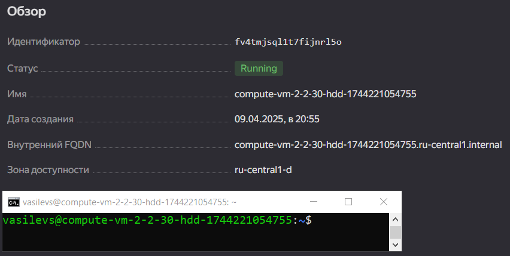
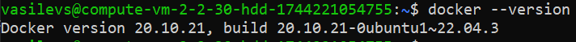
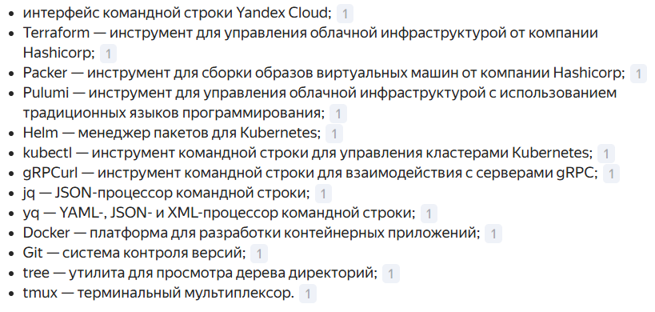
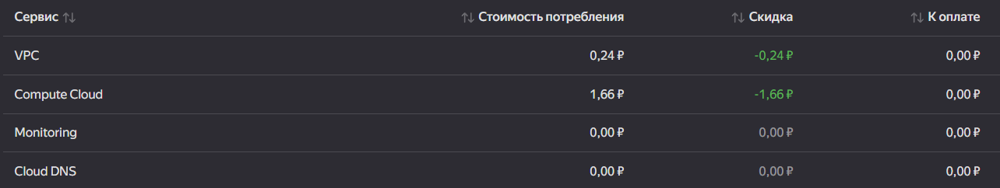

# Домашнее задание по лекции «Введение в виртуализацию» - SHVIRTD-17 - Васильев Сергей

#### Это задание для самостоятельной отработки навыков и не предполагает обратной связи от преподавателя. Его выполнение не влияет на завершение модуля. Но мы рекомендуем его выполнить, чтобы закрепить полученные знания.  Все вопросы, возникающие в процессе выполнения заданий, пишите в учебный чат или в раздел "Вопросы по заданиям" в личном кабинете.

### Цели задания
1. Научиться запускать виртуальную машину в Yandex Cloud с минимальным расходом ресурсов.
2. Попрактиковаться в выборе платформы  и системы управления виртуализации для решения требуемых задач.

### Инструкция к выполению

1. Для выполнения задачи 1 ознакомьтесь с [инструкцией](https://github.com/netology-code/devops-materials/blob/master/cloudwork.MD) по экономии облачных ресурсов и затем выполните задачу 1 по шагам.
2. Своё решение к задачам 2,3,4 загрузите  в ваш ЛК.
   
## Задача 1

Ознакомьтесь с [инструкцией ](https://github.com/netology-code/devops-materials/blob/master/cloudwork.MD) по экономии облачных ресурсов.


1. Создайте через web-интерфейс Yandex Cloud - VPC и виртуальную машину из инструкции конфигурации "эконом-ВМ" с публичным ip-адресом. В пункте "Выбор образа/загрузочного диска" выберите вкладку "Cloud Marketplace" , щелкните "Посмотреть больше", найдите образ "Yandex Cloud Toolbox".
2. Убедитесь, что вы можете подключиться к консоли ВМ через ssh, используя публичный ip-адрес. Убедитесь, что на ВМ установлен Docker с помощью команды ```docker --version```(команду выполните от имени root пользователя) !
3. Узнайте в инструкции Яндекс, какие еще инструменты предустановлены в данном образе.
4. Оставьте ВМ работать, пока она не выключится самостоятельно! Опция "прерываемая" выключит ее не позже чем через 24 часа. 
5. Для наглядности подождите еще 1 сутки.
6. Перейдите по [ссылке ](https://console.cloud.yandex.ru/billing?section=accounts). Выберите свой платежный аккаунт. Перейдите на вкладку детализация (фильтр "По продуктам") и оцените график потребления финансов.
7. Удалите ВМ или пользуйтесь ею при выполнении последующих домашних заданий курса обучения.

---

### Решение 1.

1. Создал.

2. Подключился



Версия докера 



3. Перечень утилит в составе yandex cloud toolbox



4.5. 

6. Машина потребляет примерно два рубля в сутки



7. Удалил


## Задача 2

Выберите один из вариантов платформы в зависимости от задачи. Здесь нет однозначно верного ответа так как все зависит от конкретных условий: финансирование, компетенции специалистов, удобство использования, надежность, требования ИБ и законодательства, фазы луны.

Тип платформы:

- физические сервера;
- паравиртуализация;
- виртуализация уровня ОС;

Задачи:

- высоконагруженная база данных MySql, критичная к отказу;
- различные web-приложения;
- Windows-системы для использования бухгалтерским отделом;
- системы, выполняющие высокопроизводительные расчёты на GPU.

Объясните критерии выбора платформы в каждом случае.

### Решение 2.

Для каждой из указанных задач можно выбрать наиболее подходящий тип платформы, учитывая различные факторы, такие как надежность, производительность, удобство использования и требования к безопасности.

1. **Высоконагруженная база данных MySQL, критичная к отказу**:

Тип платформы: Виртуализация на уровне гипервизора (например, VMware vSphere или KVM).

Критерии выбора:
    
Производительность: Высокая скорость обработки запросов и низкая задержка.
        
Надежность: Возможности автоматического восстановления после сбоев и репликации данных.
        
Масштабируемость: Легкость добавления новых ресурсов для поддержки роста базы данных.
        
Безопасность: Встроенные механизмы защиты данных и доступа.


2. **Различные web-приложения**:

Тип платформы: Виртуализация уровня ОС (например, Docker) или паравиртуализация (например, Xen).

Критерии выбора:
    
Гибкость: Легкость развертывания и управления приложениями.
   
Экономичность: Низкие затраты на ресурсы и простота масштабирования.
 
Совместимость: Поддержка различных сред выполнения приложений.

Безопасность: Изоляция приложений друг от друга.


3. **Windows-системы для использования бухгалтерским ПО**:

Тип платформы: Виртуализация на уровне гипервизора (например, Microsoft Hyper-V).

Критерии выбора:

Совместимость: Поддержка Windows-систем и интеграция с существующей инфраструктурой.

Управление: Удобный интерфейс для администраторов.

Экономичность: Низкая стоимость, особенно если уже используется Windows Server.

Безопасность: Встроенные механизмы защиты данных и доступа.


4. **Cистемы, выполняющие высокопроизводительные расчёты на GPU.**:

Тип платформы: Виртуализация на уровне гипервизора с поддержкой GPU-виртуализации, технология GPU Passthrough (например, VMware vSphere или KVM с NVIDIA vGPU).

Критерии выбора:

Производительность: Высокая производительность GPU и эффективное распределение ресурсов.

Масштабируемость: Возможность добавления новых GPU-ресурсов по мере необходимости.

Совместимость: Поддержка различных операционных систем и приложений, работающих с GPU.

Безопасность: Защита данных и доступа к ресурсам GPU.

## Задача 3

Выберите подходящую систему управления виртуализацией для предложенного сценария. Опишите ваш выбор.

Сценарии:

1. 100 виртуальных машин на базе Linux и Windows, общие задачи, нет особых требований. Преимущественно Windows based-инфраструктура, требуется реализация программных балансировщиков нагрузки, репликации данных и автоматизированного механизма создания резервных копий.
2. Требуется наиболее производительное бесплатное open source-решение для виртуализации небольшой (20-30 серверов) инфраструктуры на базе Linux и Windows виртуальных машин.
3. Необходимо бесплатное, максимально совместимое и производительное решение для виртуализации Windows-инфраструктуры.
4. Необходимо рабочее окружение для тестирования программного продукта на нескольких дистрибутивах Linux.

### Решение 3.

#### 1. **100 виртуальных машин на базе Linux и Windows, общие задачи, нет особых требований. Преимущественно Windows based-инфраструктура, требуется реализация программных балансировщиков нагрузки, репликации данных и автоматизированного механизма создания резервных копий.**

- Выбор: Microsoft Hyper-V или zVirt.
- Hyper-V хорошо интегрируется с Windows-инфраструктурой, обеспечивает балансировку нагрузки и репликацию данных. Однако требует лицензирования для полного функционала.
- zVirt — российская система, поддерживающая Windows и Linux, предлагает функции балансировки нагрузки и репликации, а также имеет сертификат ФСТЭК, что может быть важно для некоторых организаций.
 
#### 2. **Наиболее производительное бесплатное open source-решение для виртуализации небольшой (20-30 серверов) инфраструктуры на базе Linux и Windows виртуальных машин.**
- Выбор: KVM и построенный на нем Proxmox.

#### 3. **Бесплатное, максимально совместимое и производительное решение для виртуализации Windows-инфраструктуры.**
- Выбор:  Microsoft Hyper-V.
 
Hyper-V предлагает родную поддержку виртуализации сред Windows, обеспечивая высокую совместимость с платформами Windows. Как бесплатный гипервизор от Microsoft, он предоставляет эффективное решение для виртуализации инфраструктуры Windows..

#### 4. **Рабочее окружение для тестирования программного продукта на нескольких дистрибутивах Linux.**
- Выбор: VirtualBox.
- VirtualBox — также подходит для тестирования, особенно если требуется запуск старых или нестандартных дистрибутивов Linux, и имеет удобный интерфейс для управления виртуальными машинами

## Задача 4

Опишите возможные проблемы и недостатки гетерогенной среды виртуализации (использования нескольких систем управления виртуализацией одновременно) и что необходимо сделать для минимизации этих рисков и проблем. Если бы у вас был выбор, создавали бы вы гетерогенную среду или нет?

### Решение 4.

Гетерогенная виртуализационная среда, в которой одновременно применяются несколько систем управления виртуализацией, может вызвать следующие проблемы:


- Сложность управления: Управление различными платформами виртуализации требует значительных усилий и опыта, так как каждая из них может использовать свои собственные инструменты и методы управления.

- Несовместимость: Недостаток стандартизации может затруднить интеграцию решений от разных производителей, что снижает эффективность.

- Затраты: Использование нескольких систем виртуализации может увеличить затраты на лицензирование и поддержку

- Безопасность: В гетерогенных средах повышается риск ошибок в управлении, что может привести к дефициту ресурсов и увеличению уязвимостей безопасности.

### Правила приема

Домашнее задание выполните в файле readme.md в GitHub-репозитории. В личном кабинете отправьте на проверку ссылку на .md-файл в вашем репозитории.


